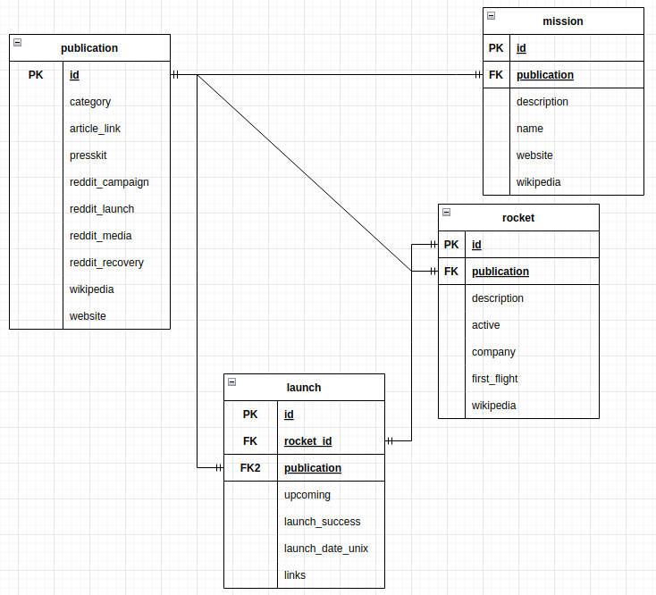

# Тестовое задание для работы в GreenAtom (Часть 2, усложненная)

---

В docker compose командой 
```
volumes:
  - ./db.sql:/docker-entrypoint-initdb.d/docker_postgres_init.sql
```
создаются база данных, таблицы и представление.

Дальше запускается скрипт, который загружает данные из GraphQL API. После этого база данных готова к подключениям.

Важно: база данных спроектирована без внешнего ключа на миссии откуда-либо, так как api не возвращает данные по миссиям. А с внешним ключом инициализация всегда останавливается с ошибкой.

Диаграмма:
